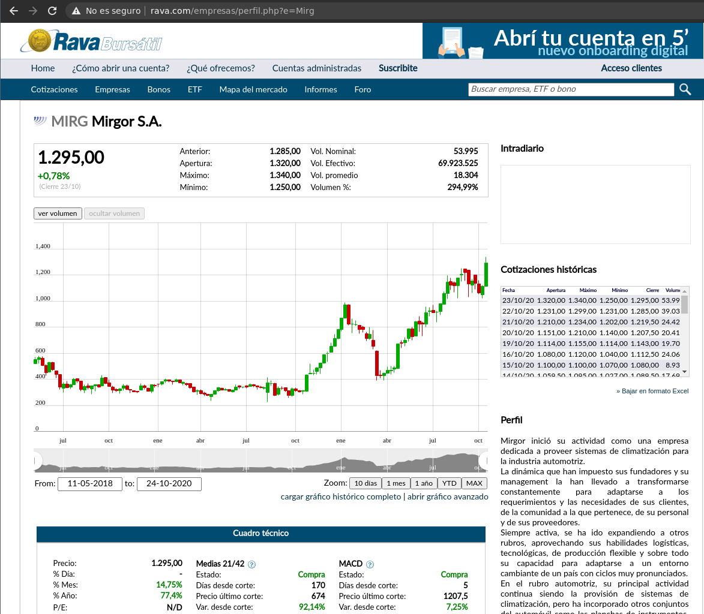
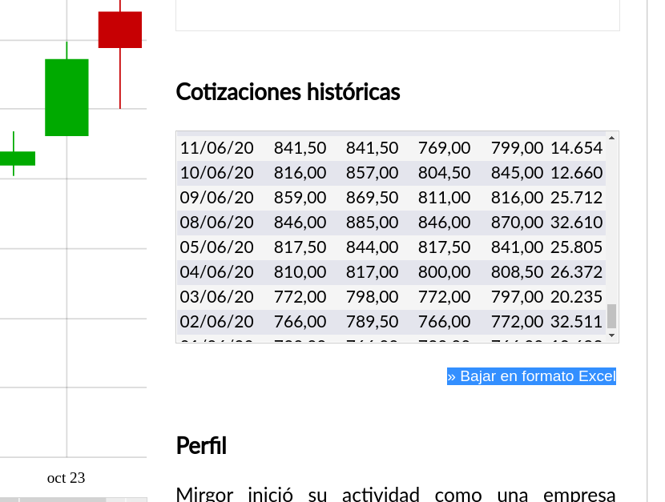

# Mini Reto 004 del grupo Python para Trading

# Leer precios del chart de una página

Dada la siguiente URL:

http://www.rava.com/empresas/perfil.php?e=Mirg

#### Obtener los precios de la web

Dicha web, muestra los precios de una empresa en una gráfica de velas. Analizar la página web para identificar la forma en que se solicitan los precios al servidor y manejar esos para poder cargarlos en un `DataFrame` y poder gestionarlos adecuadamente con Pandas. 

### Exportar Excel

Cabe mencionar que esta URL tiene una opcion para **descargar los precios historicos** en `.CSV` con tan solo pinchar en el botón que hay bajo el cuadro de precios historicos:

Que nos lleva a:

http://www.rava.com/empresas/precioshistoricos.php?e=MIRG&csv=1

**Sin embargo**, se va a usar como ejemplo para un Mini Reto dónde no la web no proporcionase la forma de exportar los datos.
