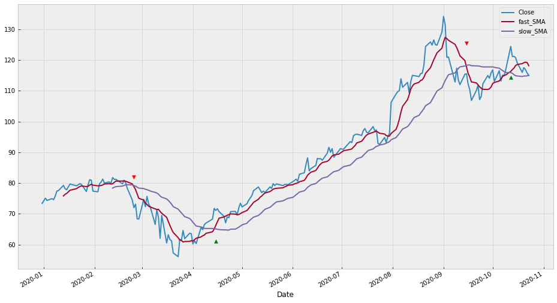

# Mini Reto 005 del grupo Python para Trading

# Indicadores - Cruce de medias moviles simples (SMA)

El objetivo de este mini reto es utilizar el indicador de SMA (Simple Moving Average) o media móvil simple, para hacer una estrategía simple de trading, con la que obtener señales de compra y venta.

El objetivo de este reto es:

- Conocer el indicador SMA y saber aplicarlo a los precios de una acción.
- Aplicar dos medias, rapida y lenta, para identificar los cruces.
- Detectar los cruces para generar señaes de compra y venta.

Para ello, partiendo del código que hay a continuación, se pide realizar los siguientes pasos:

1) Calcular en la columna `slow_SMA` y `fast_SMA` los valores correspondientes respecto a la columna `Close`

2) Detectar los cruces creando una columna `long_signal` y otra `short_signal` que valgan True cuando se produzca el cruce de medias y False el resto de los períodos.

3) Pintar en una gráfica el precio `Close` las medias rapidas y lentas `slow_SMA` `fast_SMA` y las señales de compra `long_signal` y venta `short_signal` en forma de triangulo, tal y como se indica en la siguiente imagen de resultado.

