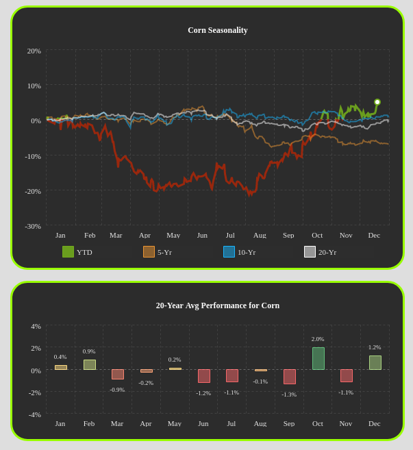

# Mini Reto 008 del grupo Python para Trading

# Patrones estacionarios - seasonality

Hablando con un miembro del grupo, **Ignacio Villalonga**, sobre posible mini Retos, decidió presentar el siguiente mini reto a modo de introducción en el análisis de patrones estacionarios.  

La estacionalidad es algo que ha estado presente desde siempre en los mercados, ya que es una de las cosas que más condicionan el día a día de todo el mundo. 

Coges vacaciones en verano, descansas los fines de semana, recibes una nómina a fin de mes, en diciembre tienes que cuadrar las cuentas del año si quieres beneficiarte fiscalmente, en invierno hace más frio, comes fruta diferente y pones más calefacción. 

Y todo eso, impacta. En un mundo globalizado, variado y tan tecnológico, quizás estos impactos cada vez sean más leves, pero existen.

Y en concreto, existen en lo que el humano no puede controlar: la posición de la tierra respecto al sol cambia, y con ello cambian las cosechas. Y con las cosechas… pasan cosas.

https://kaufmansignals.com/capturing-seasonality-with-commodity-etfs/

https://commodityseasonality.com/grains

El objetivo a estudiar en este `Mini Reto`, es si existe una ventaja estacional en alguna materia prima.

Para ello, lo ideal sería encontrar una tabla que sea capaz de darte las rentabilidades anualizadas en función de distintos periodos.

Cada columna correspondería a un año, mientras que cada fila correspondería a un periodo dentro de ese año y dentro aparecería el retorno de ese activo para ese año y periodo.

    	2011	2012	2013	2014	2015
    CW1   X%				
    CW2					
    CW3					
    CW4					
(son semanas, pero bien podrían ser días)

Partiendo del código que hay a contianuación, **se pide**:

- Calcular la evolución de los rendimientos diarios durante un año, para cada uno de los años del CORN.
- Mostrar en una gráfica la evolución de rendimientos de cada uno de los años del CORN. De tal forma que en el eje X se vea el tiempo a lo largo de un año, y en el eje Y los % de retorno. Habiendo una curva por cada uno de los distintos años. 
- Calcular los retornos mensuales medios de cada año, para el CORN.
- Mostrar en una gráfica la evolución de los rendimientos de cada mes, para cada uno de los años del CORN.
- Mostrar una nueva gráfica de barras, con los retornos mensuales medios para los últimos 10 años.
- Repetir el proceso de calculo a 10 años y mostrar en gráficos de barras, pero en lugar de mensual, semanal.

La gráficas de retornos en lineas y barras deben quedar similar a la siguiente imagen:

El objetivo final es 
